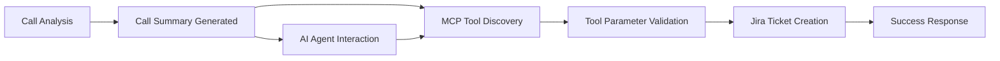

# True MCP (Model Context Protocol) Integration Guide

This guide explains how to use the **true MCP implementation** for Jira integration in the sales scoring system.

## 🎯 What is MCP?

Model Context Protocol (MCP) is a standardized protocol that allows AI models to interact with external tools and services. Unlike traditional APIs, MCP provides:

- **Automatic tool discovery** by AI agents
- **Standardized schemas** for all tools
- **Built-in validation** and error handling
- **Self-describing capabilities**
- **Protocol-level type safety**

## 🔧 MCP vs Traditional API

| Feature | Traditional API | True MCP |
|---------|----------------|----------|
| Tool Discovery | Manual documentation | Automatic introspection |
| Schema Definition | Custom per endpoint | Standardized format |
| Error Handling | Custom per service | Protocol-level consistency |
| AI Integration | Requires custom adapters | Native AI agent support |
| Protocol | HTTP REST | JSON-RPC 2.0 over SSE |

## 🚀 Running the MCP Server

The MCP server runs **independently** from the FastAPI application.

### Method 1: Using MCP CLI (Recommended)
```bash
# Install MCP CLI if not already installed
pip install mcp

# Run the MCP server
cd backend
mcp run app.mcp_jira_server:server
```

### Method 2: Using the Runner Script
```bash
cd backend
python run_mcp_server.py
```

### Method 3: Direct Import
```python
import asyncio
from app.mcp_jira_server import server

# The server object is ready to use
tools = await server.list_tools()
print(f"Available tools: {[tool.name for tool in tools]}")
```

## 🛠️ Available MCP Tools

### 1. `check_jira_health`
Check Jira integration status and configuration.

**Parameters:** None

**Example:**
```json
{
  "name": "check_jira_health",
  "arguments": {}
}
```

### 2. `create_jira_ticket`
Create a single Jira ticket with specified details.

**Parameters:**
- `summary` (required): Brief summary of the ticket
- `description` (required): Detailed description
- `issue_type` (optional): Issue type (default: "Task")
- `priority` (optional): Priority level (default: "Medium")
- `project_key` (optional): Project key (uses default if not specified)
- `assignee` (optional): Username of assignee
- `labels` (optional): Array of labels

**Example:**
```json
{
  "name": "create_jira_ticket",
  "arguments": {
    "summary": "Follow up with client about proposal",
    "description": "Contact ООО РосИнвест regarding pending technical proposal",
    "priority": "High",
    "labels": ["mcp-created", "sales-follow-up"]
  }
}
```

### 3. `create_tickets_from_call_summary`
Extract recommendations from call summary and create corresponding tickets.

**Parameters:**
- `call_summary` (required): Complete call summary object
- `client_name` (optional): Client name for context
- `assignee` (optional): Username for all tickets
- `project_key` (optional): Override default project

**Example:**
```json
{
  "name": "create_tickets_from_call_summary",
  "arguments": {
    "call_summary": { /* complete call summary object */ },
    "client_name": "ООО РосИнвест",
    "assignee": "sales.manager@company.com"
  }
}
```

### 4. `analyze_call_recommendations`
Analyze call summary without creating tickets (preview mode).

**Parameters:**
- `call_summary` (required): Complete call summary object
- `client_name` (optional): Client name for context

### 5. `get_jira_config`
Get current Jira configuration (non-sensitive data only).

**Parameters:** None

### 6. `generate_sample_call_summary`
Generate sample data for testing.

**Parameters:** None

## 📡 Using MCP Tools

### With MCP Client Libraries

```python
from mcp.client import Client

async def use_mcp_tools():
    # Connect to MCP server
    client = Client("ws://localhost:8000/mcp")
    
    # List available tools
    tools = await client.list_tools()
    print(f"Available: {[t.name for t in tools]}")
    
    # Call a tool
    result = await client.call_tool(
        "check_jira_health",
        {}
    )
    print(f"Health: {result}")
    
    # Create a ticket
    ticket_result = await client.call_tool(
        "create_jira_ticket",
        {
            "summary": "Test ticket from MCP",
            "description": "Created via MCP protocol",
            "priority": "Medium"
        }
    )
    print(f"Created: {ticket_result}")
```

### With JSON-RPC 2.0 (HTTP)

```bash
# List tools
curl -X POST http://localhost:8000/mcp/tools/list \
  -H "Content-Type: application/json" \
  -d '{"jsonrpc": "2.0", "id": 1, "method": "tools/list"}'

# Call a tool
curl -X POST http://localhost:8000/mcp/tools/call \
  -H "Content-Type: application/json" \
  -d '{
    "jsonrpc": "2.0",
    "id": 1,
    "method": "tools/call",
    "params": {
      "name": "check_jira_health",
      "arguments": {}
    }
  }'
```

### With AI Agents (Claude, GPT, etc.)

AI agents can automatically discover and use MCP tools:

```
AI Agent: "I need to create Jira tickets from this call summary"

MCP System: 
1. Discovers available tools automatically
2. Validates call summary format
3. Calls create_tickets_from_call_summary
4. Returns structured results

AI Agent: "Created 5 tickets successfully!"
```

## 🔧 Configuration

Set up your environment variables:

```bash
# Enable Jira integration
JIRA_ENABLED=true

# Jira configuration
JIRA_BASE_URL=https://your-domain.atlassian.net
JIRA_USERNAME=your-email@example.com
JIRA_API_TOKEN=your-api-token
JIRA_PROJECT_KEY=SALES
JIRA_DEFAULT_ISSUE_TYPE=Task
JIRA_DEFAULT_PRIORITY=Medium
```

## 🧪 Testing the MCP Integration

### Run Integration Tests
```bash
cd backend
python test_mcp_integration.py
```

### Manual Testing
```bash
# Test with example usage
python example_mcp_usage.py

# Get cURL examples
python example_mcp_usage.py curl
```

### Validate MCP Compliance
```bash
# Check server structure
python -c "from app.mcp_jira_server import server; print('✅ MCP server valid')"

# List tools programmatically
python -c "
import asyncio
from app.mcp_jira_server import server

async def test():
    tools = await server.list_tools()
    print('Tools:', [t.name for t in tools])

asyncio.run(test())
"
```

## 🔒 Security Considerations

### Authentication
- MCP server uses the same Jira credentials as the FastAPI app
- API tokens are stored securely in environment variables
- No sensitive data is exposed through tool schemas

### Authorization
- Tools validate Jira configuration before execution
- Failed operations return structured error responses
- All operations are logged for audit trails

### Network Security
- MCP server can run on internal networks only
- Supports TLS encryption for production deployments
- Rate limiting can be implemented at the protocol level

## 🚨 Troubleshooting

### Common Issues

1. **"Server not found"**
   ```bash
   # Make sure the server is running
   mcp run app.mcp_jira_server:server
   ```

2. **"Jira integration disabled"**
   ```bash
   # Check environment variables
   export JIRA_ENABLED=true
   ```

3. **"Tool schema validation failed"**
   ```bash
   # Validate call summary structure
   python -c "
   from app.models import CallSummarizationResponse
   # Test with your data
   "
   ```

4. **"Connection refused"**
   ```bash
   # Check if MCP server is running on correct port
   ps aux | grep mcp
   netstat -an | grep 8000
   ```

### Debug Mode
```bash
# Enable detailed logging
export LOG_LEVEL=debug

# Run with verbose output
mcp run app.mcp_jira_server:server --verbose
```

## 📊 Monitoring

### Health Checks
```bash
# Check MCP server health
curl -X POST http://localhost:8000/mcp/tools/call \
  -d '{"jsonrpc": "2.0", "id": 1, "method": "tools/call", "params": {"name": "check_jira_health", "arguments": {}}}'
```

### Metrics
- Tool call frequency and success rates
- Error rates by tool type
- Response times for ticket creation
- Jira API quota usage

### Logging
```python
# All MCP operations are logged
logger.info("MCP: Tool called successfully")
logger.error("MCP: Tool call failed")
```

## 🔄 Integration Workflow



### Typical AI Agent Flow:
1. **Discovery**: Agent discovers available MCP tools
2. **Analysis**: Agent analyzes call summary structure
3. **Validation**: MCP validates parameters automatically
4. **Execution**: Tool creates Jira tickets with context
5. **Response**: Structured success/error response returned

## 🎯 Benefits of True MCP Implementation

### For Developers
- **Standardized Integration**: No custom API clients needed
- **Automatic Validation**: Schema validation built-in
- **Type Safety**: Strong typing throughout the protocol
- **Error Consistency**: Standardized error responses

### For AI Agents
- **Auto-Discovery**: Find tools without hardcoding
- **Self-Documentation**: Tools describe their own capabilities
- **Reliable Integration**: Protocol-level error handling
- **Context Preservation**: Rich metadata in tool calls

### For Operations
- **Monitoring**: Built-in logging and metrics
- **Security**: Standardized auth and validation
- **Scalability**: Protocol designed for high-volume usage
- **Debugging**: Clear error messages and request tracing

## 🚀 Next Steps

1. **Deploy MCP Server**: Set up in your production environment
2. **Configure AI Agents**: Connect your AI systems to the MCP server
3. **Monitor Usage**: Track tool calls and success rates
4. **Extend Tools**: Add more MCP tools for other integrations
5. **Scale**: Deploy multiple MCP servers for high availability

The true MCP integration provides a robust, standardized way for AI agents to create Jira tickets from call analysis, enabling seamless automation of your sales follow-up processes.
